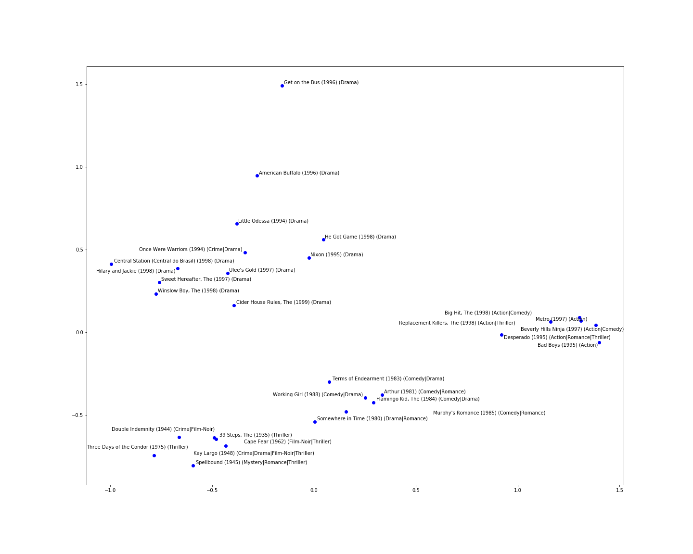

Movies2Vec
==============================

**Learn embeddings** from Movielens 1M, a movie reviews dataset, by applying **Word2Vec's Skip-Gram with negative sampling** architecture.

A movie recommender system can be built using these embeddings. A user can select a list of movies, add them to either the liked or disliked lists and then ask for a series of movie suggestions. The model will try to predict the **most similar movies** to the ones found in the liked list (i.e. the distance between the embeddings is as small as possible), which are at the same time very different from the movies found in the disliked list (i.e. the distance between the embeddings should be as large as possible in the latent space).

For an online demo of the recommender system please enter [here](https://movies2vec-306320.firebaseapp.com/#/).

Below there's a 2D visual representation of the embeddings of 25 movies that were randomly picked from the dataset:

The project consists in a series of Jupyter notebooks and python scripts strucured in the following way:
1. `src/data/initial_exploration.ipynb`: contains some raw data exploration analysis
2. `src/data/make_dataset.py`: cleans the raw data and prepares it for training; the final dataset is exported to `data/processed/data.csv`
3. `src/model_creation.ipynb`: contains the model training and evaluation steps
4. `src/prediction.ipynb`: uses the trained model to make predictions; A series of random resulted embeddings have been plotted in 2D space in order to highlight possible clusters formed around similar shopping bag items.

## Install
Run `pip install -r requirements.txt` to install dependencies.

